# 📸 Gallery - BloodHound VENOM

<div align="center">

**Complete photo documentation of the BloodHound VENOM project**

[← Back to README](README.md)

</div>

---

## 🎨 Photo Gallery

### Parts & Components

#### All Components Overview
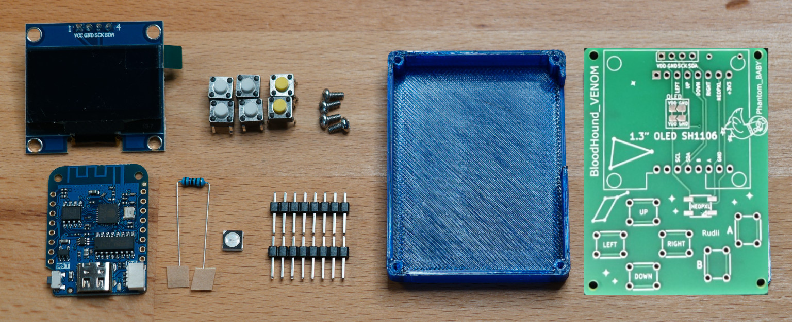

*Complete set of components ready for assembly. Includes:*
- D1 Mini microcontroller
- OLED display module  
- 6 push buttons
- RGB LED
- Resistors and headers
- PCB

---

#### Alternative Components View
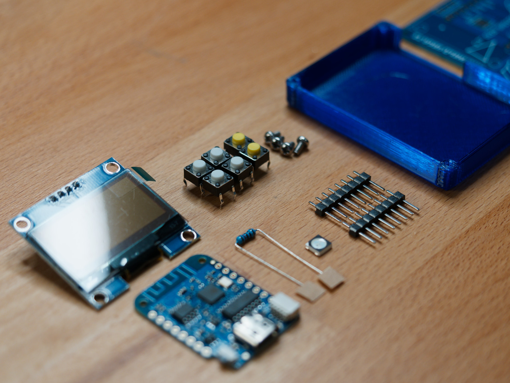

*Component layout and organization for soldering.*

---

### Tools Required

#### Soldering & Assembly Tools
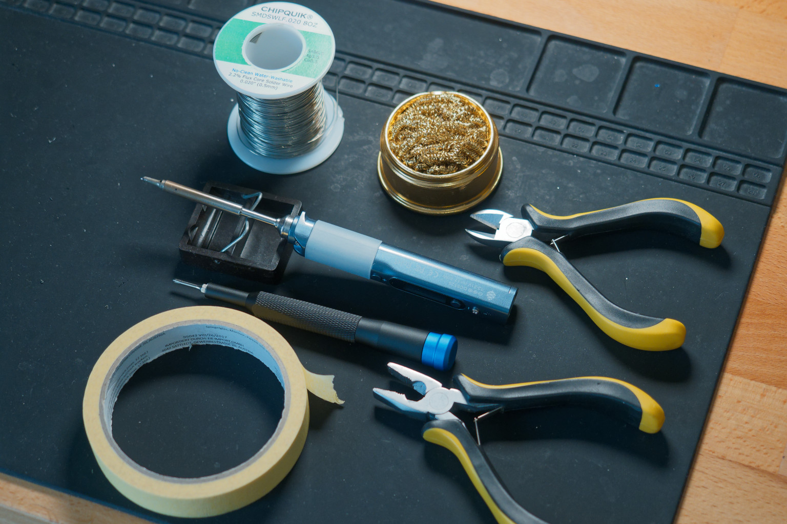

*Essential tools for assembly:*
- 🔥 Soldering iron and solder
- 🔪 Wire cutters
- 📌 Tweezers
- 🧪 Multimeter
- 🔬 Magnifying glass
- 🛡️ Helping hands
- ✂️ Flux pen

---

### OLED Display Setup

#### OLED Pin Configuration
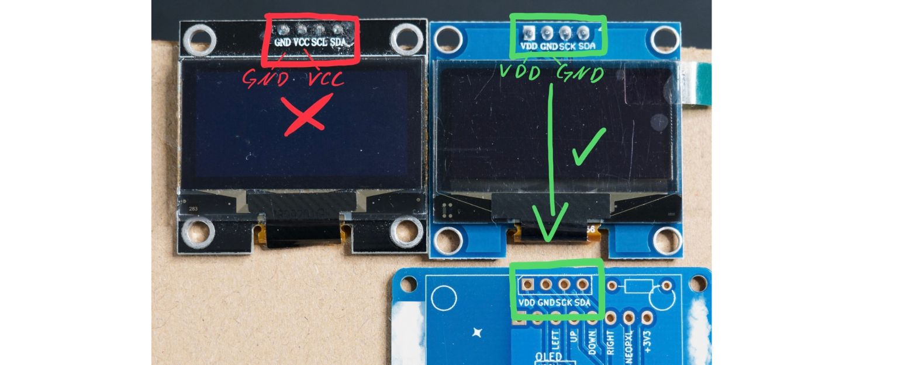

**IMPORTANT PIN ORDER:**

```
OLED I2C Module Pins (left to right):
Pin 1: VDD (Power) ── 3.3V
Pin 2: GND (Ground) ──── GND
Pin 3: SCL (Clock) ─── GPIO5 (D1)
Pin 4: SDA (Data) ──── GPIO4 (D2)
```

⚠️ **Verify pin order on your specific module - some have reversed order!**

---

### Main Device

#### Final BloodHound VENOM Device


*Complete assembled device with:*
- 6-button control layout
- 1.3" OLED display
- RGB status LED
- Compact form factor
- Ready for programming

---

### Battery Modification Variant

#### LiPo Battery Integration - Overview
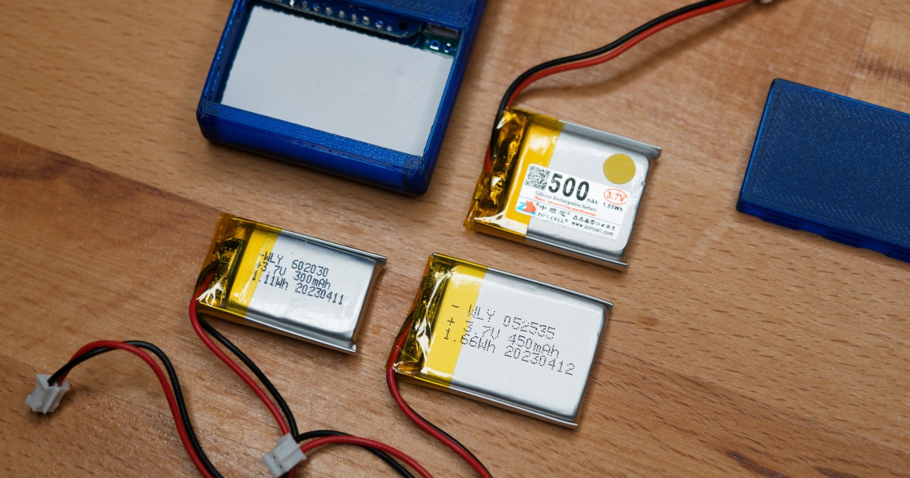

*Device modified to support LiPo battery power*

---

#### Battery Modification Step 1
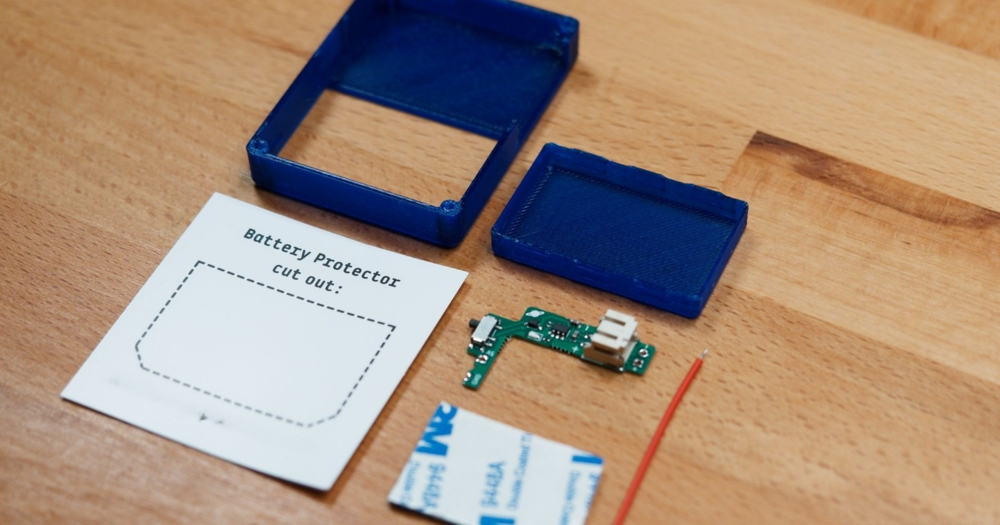

*Initial battery integration setup*

---

#### Battery Modification Close-up
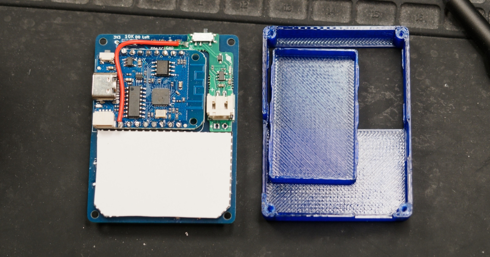

*Detailed view of battery connections*

---

#### Battery Integration Advanced
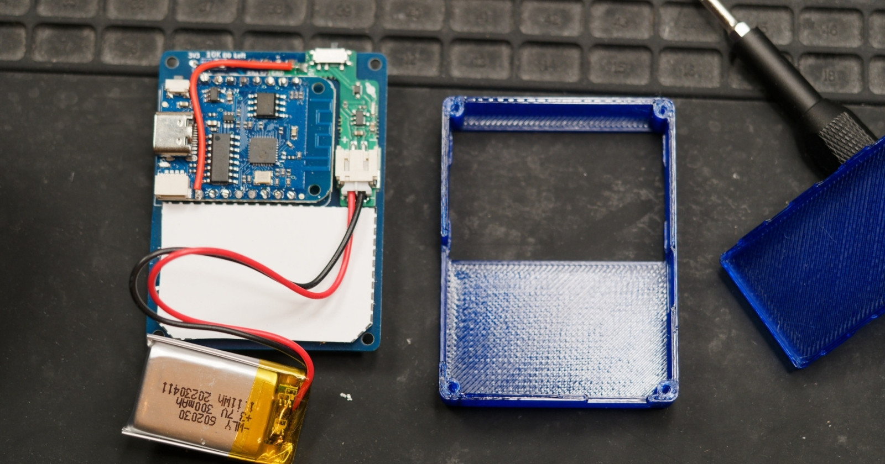

*Further integration stages*

---

#### Battery with Case Housing
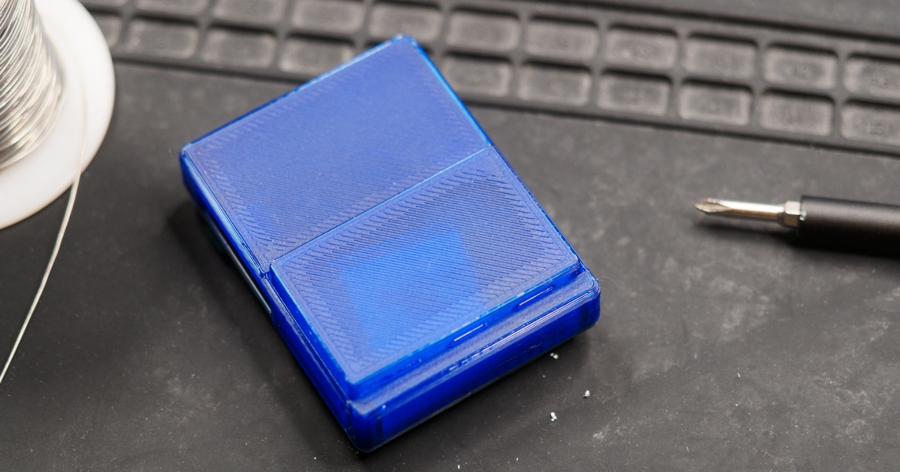

*Battery variant inside protective case*

---

#### Battery PCB Layout
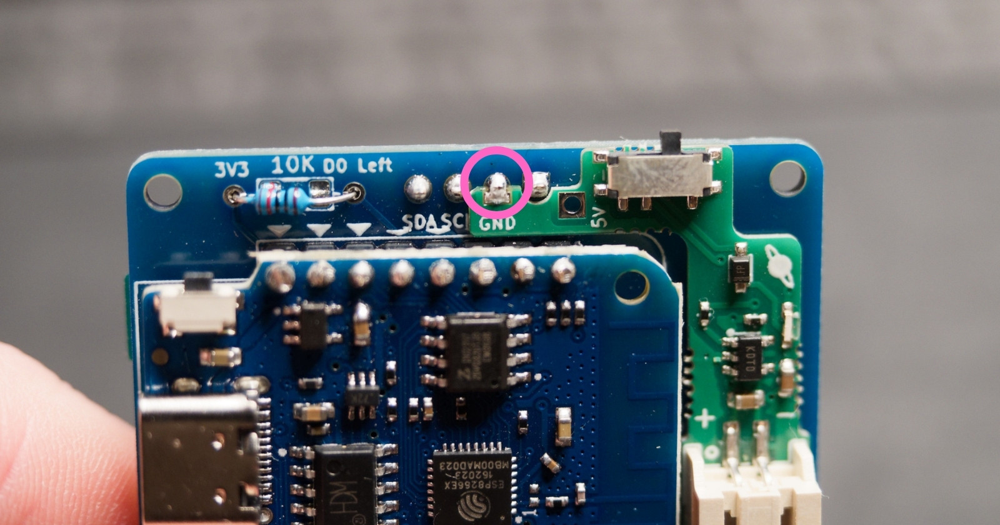

*LiPo variant PCB design showing battery connector placement*

---

#### Battery Wiring - Initial
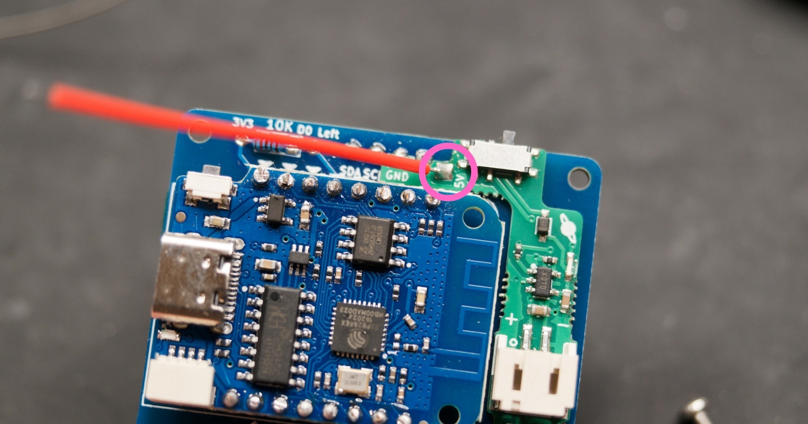

*Wiring harness for battery connections*

---

#### Battery Configuration Guide
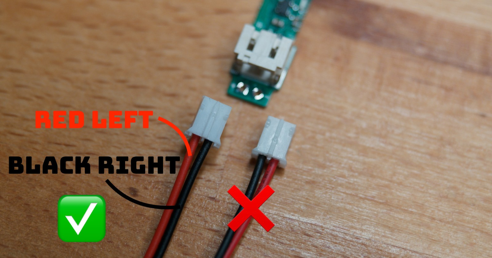

*Detailed wiring configuration reference*

---

#### Battery Soldering Process
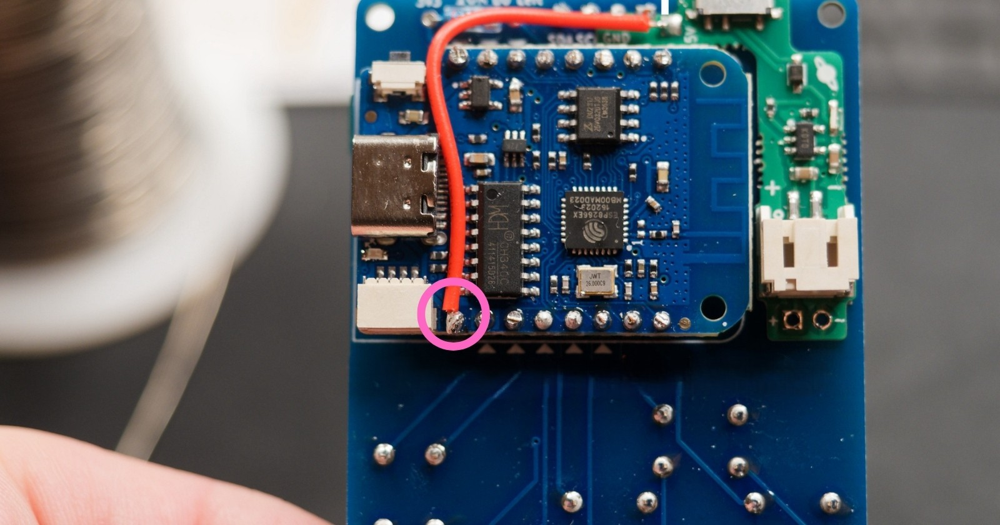

*Soldering battery connectors to PCB*

---

#### Complete Battery Assembly
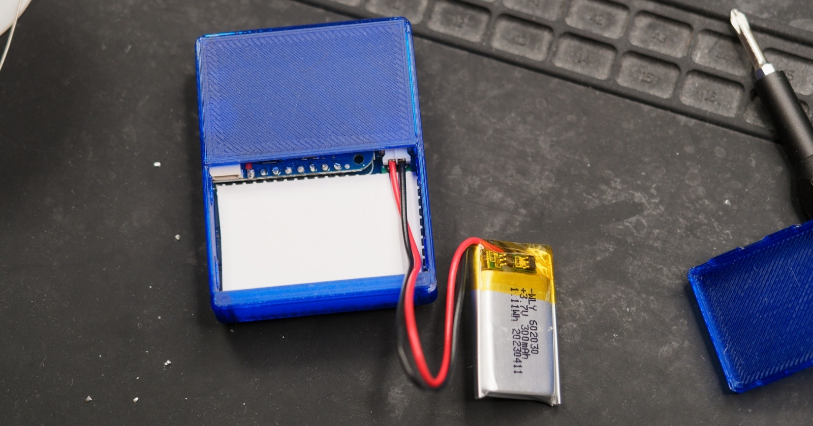

*Fully assembled battery-powered variant with case*

---

### Size Comparison

#### With & Without Battery Comparison


*Visual size difference between:*
- Standard USB-powered version
- LiPo battery variant

Notice the slightly increased thickness for battery accommodation.

---

## 📊 Build Statistics

| Component | Photos | Status |
|-----------|--------|--------|
| **Parts & Components** | 2 | ✅ Complete |
| **Tools Required** | 1 | ✅ Complete |
| **OLED Display** | 1 | ✅ Complete |
| **Main Device** | 1 | ✅ Complete |
| **Battery Variant** | 7 | ✅ Complete |
| **Size Comparison** | 1 | ✅ Complete |
| **Total Photos** | **13** | ✅ Complete |

---

## 🎥 Photo Tips & Best Practices

When documenting your build, capture:

✅ **Component Photos**
- All parts laid out and organized
- Close-ups of small components
- Pin configurations and labels

✅ **Assembly Progress**
- PCB before soldering
- Soldering in progress
- Component installation steps
- Quality control checks

✅ **Final Device**
- Working device powered on
- Display showing content
- All buttons accessible
- LED lit up

✅ **Custom Modifications**
- Unique design changes
- Color variants
- Special enclosures
- Innovative use cases

✅ **Comparison Shots**
- Size references (coin, hand)
- Before/after modifications
- Different variants together

---

## 🖼️ Gallery Organization

### By Category

**📦 Components** → See all parts and tools
**🔧 Assembly** → Step-by-step building
**💻 Final Product** → Complete working device
**🔋 Variants** → LiPo battery modifications
**📊 Comparisons** → Size and feature differences

### By Build Stage

1. **Preparation** → Component photos, tools
2. **Assembly** → Soldering, component placement
3. **Testing** → Powered on, functionality check
4. **Casing** → 3D printed housing, final assembly
5. **Customization** → Mods, variants, upgrades

---

## 📸 Share Your Build!

Built your own BloodHound VENOM? Share it with the community!

**Ways to share:**
- 📧 Submit photos via GitHub Issues
- 🌐 Tag on social media
- 📝 Document on your blog
- 🎥 Make a build video
- 💬 Share in community forums

**What to include:**
- Clear, well-lit photos
- Build time and cost breakdown
- Modifications or variations
- Performance observations
- Any tips or tricks learned

---

## 🎨 Design Inspiration

Use these photos as inspiration for:
- **Component sourcing** - See exact parts to buy
- **Soldering technique** - Visual reference for pad coverage
- **Cable management** - Battery wiring examples
- **Enclosure design** - Case fit and button placement
- **Customization ideas** - Possible modifications shown

---

<div align="center">

### 🌟 Your Build Could Be Here!

**Have photos of your BloodHound VENOM build?**

Consider contributing them to the gallery to inspire other makers!

---

[← Back to README](README.md) | [← Assembly Guide](ASSEMBLY.md) | [Firmware Guide →](FIRMWARE.md)

**Made with ❤️ by [Rudra Sharma](http://rudrasharma.tech/)**

</div>
